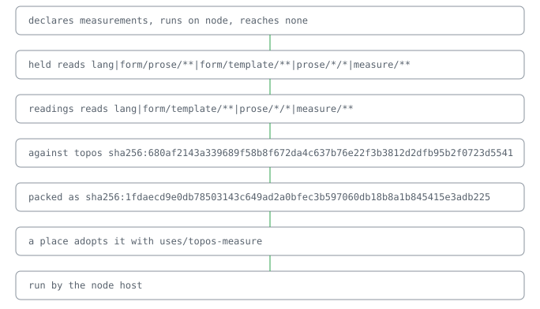

# @lapxo/topos-measure

     

One cell for every quantity.

A world for readings. Point it at what you measure, thermometers, sensors, a CSV, and it folds every reading into a cell with a floor and a ceiling, and every second instrument into an encounter. [its regions, read off its own descriptor](docs/reference.md)

## Why one cell

A reading from one instrument is potential. Two independent instruments that agree make information, and the world tells you how much: in bits.

## Four thermometers, one room

The four origins that measured room do not meet: no value in celsius is held by all of their readings, and no average of them closes that.

## Readings

| quantity | origin | reading |
|---|---|---|
| room | a | 19.8..20.2 celsius |
| room | b | 19.9..20.3 celsius |
| room | c | 19.7..20.1 celsius |
| room | d | 24..24.4 celsius |

## What it claims

- **It costs 2 dependencies: the algebra its cells are read by and the SDK it answers through.** · [receipt](receipts.bound)

## Line

Add to your lock:
sources/topos-measure value=github:Lapxo/topos-measure
uses/topos-measure sha256:<release digest>
https://github.com/Lapxo/topos-measure/releases
Fetch the release asset, verify its sha256 equals the uses/ line, place it in bound/cas/blobs/. Fold: its pages appear.
open: line/install needs=host/resolve — when bound resolves sources/ itself, the fetch line leaves the page by fold.

## How to read it

topos-measure is read one region at a time, and each answers one question.

- **held** · what the readings of one quantity hold together, and in which state their cell is
- **readings** · what each origin read of each quantity, in the unit its line names

It rests on obligations and topos.

## Check

● 0 cases hold

● `npm ci && npm run build`

## Pointers

- [Reference](docs/reference.md)
